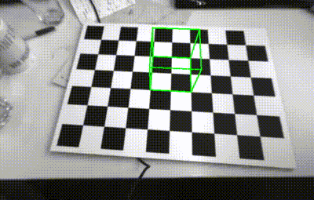
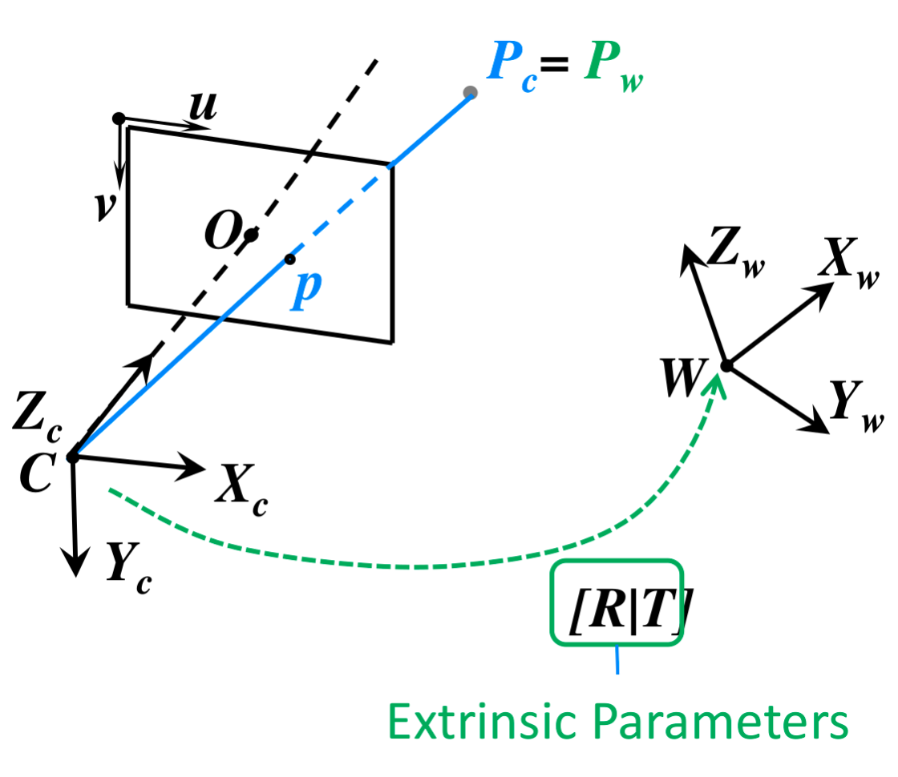
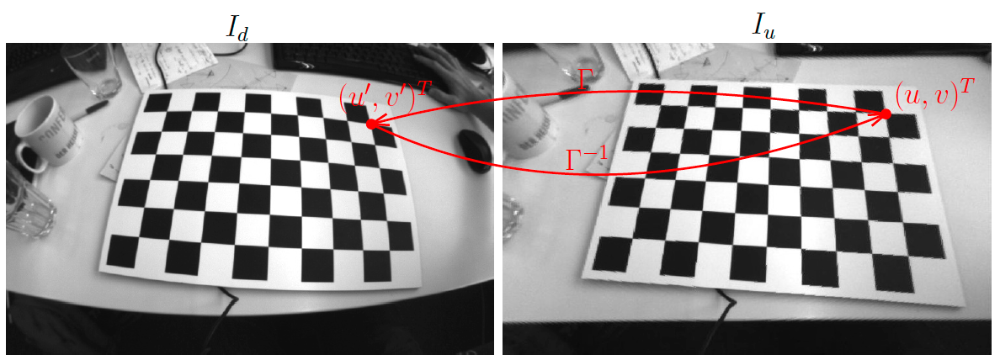
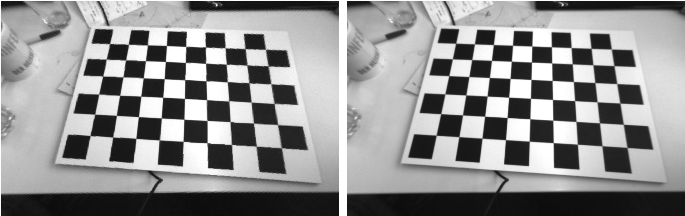

# PA2: Augmented Reality
The goal of this exercise is to superimpose a virtual cube on a video of a planar grid viewed from different orientations. **In this exercise, the 3D positions of the checkerboard, and the relative camera poses are provided**, as well as the intrinsics of the camera. The purpose of this exercise is to familiarize with the basics of perspective projection, change of coordinate systems and lens distortion, as well as basic image processing with Python.

<center>  </center>

## Installation
```bash
$ conda env create -f environment.yaml
$ conda activate aue8089pa2
```

## Reminder: Perspective Projection

Below figure is a reminder of the different steps involved in projecting a 3D point $P_w$ (expressed in the world coordinate frame) to the image plane of camera $C$, when the intrinsics (camera matrix $K$ and transformation $[R|t]$) are known.

<center>  </center>

### Equation of perspective projection
Assuming the lens distortion has already been compensated (which is the case in this section), the perspective projection can be written linearly in homogeneous coordinates as shown in the lecture:

$$\lambda\begin{bmatrix} u \newline v \newline 1 \end{bmatrix}=K[R|t]\begin{bmatrix}X_w \newline Y_w \newline Z_w \newline 1 \end{bmatrix}$$

where $(u, v)^T$ is the desired projection given in pixel coordinates, and $P_w=(X_w, Y_w, Z_w)^T$. $K$ is a $3\times 3$ matrix also called the camerea matrix. This matrix is provided to you in `K.txt`.


### Axis-angle representation for rotations
In this exercise, the rotation $R$ from the world frame to the camera frame is given using the axis-angle representation for rotations. Specifically, a 3D rotation is parameterized by a 3D vector $w = (w_x, w_y, w_z)^T$, where $k = \frac{w}{||w||}$ is a unit vector indicating the axis of rotation, and $||w||=\theta$ is the magnitude of the rotation about the axis. Rodrigues' rotation formula allows to convert this representation to a rotation matrix:

$$ R=I+(\text{sin}~\theta)[k]_\times +(1-\text{cos}~\theta)[k]_\times^2$$

where $[k]_{\times}=\begin{bmatrix} 0 & -k_z & k_y \newline k_z & 0 & -k_x \newline -k_y & k_x & 0 \end{bmatrix}$ is the cross-product matrix for the vector $k$.


### Drawing the cube
- Write some code to create a matrix containing the 8 vertices of a cube lying on the checkerboard’s plane. The position of the cube on the checkerboard and its size should be customizable.
- Project the cube's vertices on the image and draw a line (line) for each edge of the cube.


### Generating a video from the images
Repeat the process above for all the images in the sequence and generate a small movie (at 20 frames per second).


### Lens distortion modelling
Real camera lenses are not ideal and introduce some distortion in the image. To account for these non-idealities, it is necessary to add a distortion model to the equations of perspective projection. A simple radial distortion model was introduced during the lecture. In this exercise, we use this model, and simply add a higher-order term, parameterized by an additional variable $k_2$. The distortion model is therefore fully parameterized by two variables $(k_1, k_2)$ that are provided in the file `D.txt`. Because the distortion model is not linear, the projection function needs to split into two steps.

- We start again by mapping the world point $P_w$ to pixel coordinates $p = (u, v)^T$.

$$\lambda\begin{bmatrix}u \newline v \newline 1 \end{bmatrix}=K[R|t]\begin{bmatrix}X_w \newline Y_w \newline Z_w \newline 1 \end{bmatrix}$$

- Next, we apply lens distortion to $p$ to get the distorted pixel coordinates $p_d = (u_d, v_d)^T$:

$$\begin{bmatrix}u_d \newline v_d \end{bmatrix}=(1+k_1r^2+k_2r^4)\begin{bmatrix}u-u_0 \newline v-v_0\end{bmatrix} \begin{bmatrix}u_0 \newline v_0 \end{bmatrix} $$
where $r^2=(u-u_0)^2+(v-v_0)^2$ is the radial component of $p$ and the values $u_0$ and $v_0$ denote the optical center (derived from the calibration matrix $K$).


### Undistorting the images
We will now use the new projection function (that takes distortion into account) to generate an undistorted image from the original image. Let $I_d$ and $I_u$ be respectively the distorted and undistorted images. A naive way to undistort $I_d$ would be through forward warping, i.e warp every pixel $(u_0; v_0)^T$ in $I_d$ to $I_u$ as follows:
$$I_u(\Gamma^{-1}(u', v'))=I_d(u', v')$$

where $\Gamma(u,v)=(u', v')$ is the distortion function that maps undistorted pixel coordinates $(u, v)^T$ to distorted pixel coordinates $(u', v')^T$.

<center>  </center>


However, due to the undistorted pixel locations being non-integer, the resulting image would have some artifacts. Moreover, inverting the distortion function $\Gamma$ amounts to solving a system of polynomial system of equations, which is costly. In image processing, this is commonly solved by doing backward warping, i.e. warping pixel locations from the destination image ( undistorted image in our case) to the source image (distorted image in our case):
$$I_u(u, v) = I_d(\Gamma(u, v))$$


Since $\Gamma(u, v) = (u', v')^T$ are non-integer pixel locations, the image intensity $I_d(u', v')$ must be estimated at the non-integer pixel location $(u', v')$. The most simple way to do it is through nearest-neighbor interpolation, i.e. approximating $I_d(u', v')\approx I_d(\lfloor u' \rfloor, \lfloor v' \rfloor)$, where $\lfloor x \rfloor$ denotes the closest
integer to x.
- Write a function undistort_image that performs the image undistortion and nearest-neighbor interpolation. The expected output is shown below.

<center>  </center>
